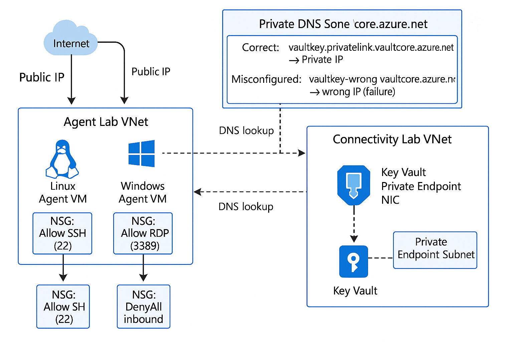

# Azure DevOps Agent & Connectivity Lab


## Overview



This Terraform-driven lab builds **two** Azure environments:

- **Agent Lab**: a self-hosted DevOps agent VM in its own VNet with SSH access.  
- **Connectivity Lab**: a Key Vault secured by a private endpoint, plus a Private DNS zone with both a correct and an intentionally “wrong” A-record to simulate DNS failures and firewall blocks.

You’ll supply inputs via `.tfvars`, inspect outputs for verification (SSH, DNS, private-endpoint), and tear down cleanly.

## Table of Contents

1. [Overview](#overview)  
2. [Objectives](#objectives)  
3. [Prerequisites](#prerequisites)  
4. [Directory Layout](#directory-layout)  
5. [Variables & tfvars](#variables--tfvars)  
6. [SSH Key Setup](#ssh-key-setup)  
7. [Deploying the Lab](#deploying-the-lab)  
   - [Initialize](#initialize)  
   - [Plan](#plan)  
   - [Apply](#apply)  
   - [Destroy](#destroy)  
8. [Lab Inventory](#lab-inventory)  
9. [Troubleshooting & Tips](#troubleshooting--tips)  
10. [PowerShell Inventory Script](#powershell-inventory-script)  
11. [Additional Resources](#additional-resources)  


## Objectives

- Design a single Terraform project for dual scenarios.  
- Pin Terraform and AzureRM provider versions.  
- Declare Azure resources for both labs (RG, VNet, subnets, NSG, VM, Key Vault, Private Endpoint, Private DNS).  
- Inject your SSH public key via a variable.  
- Execute the full Terraform lifecycle (`init`, `plan`, `apply`, `destroy`).  

---

## Prerequisites

- **Azure Subscription** with **Contributor** role  
- **Azure CLI** or **PowerShell 7+ Az** modules  
- **Terraform CLI ≥ 1.4.0**  
- **Git** for cloning this repository  

---

## Directory Layout

```plaintext
/
├── .gitignore
├── README.md                 ← This file
├── Terraform_Lab_Resource.md ← Resource-inventory doc
├── terraform/
│   ├── versions.tf
│   ├── variables.tf
│   ├── main.tf
│   ├── outputs.tf
│   └── terraform.tfvars.example
├── scripts/
│   └── Inventory-NetworkResources.ps1
└── artifacts/                 ← Ignored by .gitignore
    ├── CSV/
    ├── JSON/
    └── Logs/
````

---

## Variables & tfvars

All inputs live in `terraform/variables.tf`. Copy
`terraform/terraform.tfvars.example` → `terraform/terraform.tfvars` and update:

```hcl
# --- Agent Lab ---
agent_rg_name            = "tf-agent-lab-rg"
agent_location           = "westus2"
agent_vnet_name          = "agent-vnet"
agent_vnet_address_space = ["10.0.0.0/16"]
agent_subnet_name        = "agent-subnet"
agent_subnet_prefix      = "10.0.1.0/24"
public_ip_name           = "agent-vm-pip"
nic_name                 = "agent-vm-nic"
vm_name                  = "agent-vm"
vm_size                  = "Standard_B1ms"
admin_username           = "azureuser"
admin_ssh_key            = file("~/.ssh/terraform_lab_key.pub")

# --- Connectivity Lab ---
connect_rg_name              = "tf-connect-lab-rg"
connect_location             = "westus2"
connect_vnet_name            = "connect-vnet"
connect_vnet_address_space   = ["10.1.0.0/16"]
connect_agents_subnet_name   = "connect-agents-subnet"
connect_agents_subnet_prefix = "10.1.1.0/24"
connect_pe_subnet_name       = "connect-pe-subnet"
connect_pe_subnet_prefix     = "10.1.2.0/24"
key_vault_name               = "lab-kv-1234"
wrong_kv_ip                  = "10.1.2.50"
```

---

## SSH Key Setup

Terraform requires your **public** SSH key to provision the Linux VM securely. Here’s **what**, **why**, and **how**—for macOS, Linux, or Windows.

### What are SSH keys?

An SSH key pair consists of:

* A **public key** (`id_rsa.pub`) that you share with servers.
* A **private key** (`id_rsa`) that remains on your local machine.

### Why use SSH keys?

* **Security**: far stronger than passwords.
* **Automation**: log in without entering credentials each time.
* **Cross-platform**: works on macOS, Linux, and Windows.

### Generating an SSH key pair

#### On macOS or Linux

1. Open Terminal.
2. Run:

   ```bash
   ssh-keygen -t rsa -b 4096 -f ~/.ssh/terraform_lab_key -C "terraform-agent"
   ```
3. Press **Enter** to accept the default location.
4. (Optional) Provide a passphrase for extra security, or press **Enter** for none.
5. You now have:

   * `~/.ssh/terraform_lab_key` (private key)
   * `~/.ssh/terraform_lab_key.pub` (public key)

#### On Windows (PowerShell)

1. Open **PowerShell**.
2. Run:

   ```powershell
   ssh-keygen -t rsa -b 4096 -f $HOME\.ssh\terraform_lab_key -C "terraform-agent"
   ```
3. Accept prompts for location and passphrase.
4. You’ll see:

   * `$HOME\.ssh\terraform_lab_key` (private key)
   * `$HOME\.ssh\terraform_lab_key.pub` (public key)

### Configuring Terraform

In your `terraform.tfvars`, reference the **public** key:

```hcl
admin_ssh_key = file("~/.ssh/terraform_lab_key.pub")
```

Terraform will place this in `/home/<admin_username>/.ssh/authorized_keys` on the VM.

### Testing SSH connectivity

After `terraform apply`, Terraform outputs the VM’s public IP:

```bash
ssh -i ~/.ssh/terraform_lab_key azureuser@<PUBLIC_IP>
```

Replace `<PUBLIC_IP>` with the `agent_vm_public_ip` output. If you set a passphrase, you’ll be prompted to unlock your private key.

---

## Deploying the Lab

### Initialize

```bash
cd terraform
terraform init
```

### Plan

```bash
terraform plan -out=tfplan -var="admin_ssh_key=$(cat ~/.ssh/terraform_lab_key.pub)"  
```

### Apply

```bash
terraform apply "tfplan"
```

Watch the outputs—SSH IP, Key Vault private-endpoint IP, and DNS A-records.

### Destroy

```bash
terraform destroy -auto-approve -var="admin_ssh_key=$(cat ~/.ssh/terraform_lab_key.pub)"
```

---

## Lab Inventory

| Lab Component        | Resource Type                | Name / Variable              | Purpose                                         |
| -------------------- | ---------------------------- | ---------------------------- | ----------------------------------------------- |
| **Agent Lab**        | Resource Group               | `agent_rg_name`              | Contains agent VM & networking                  |
|                      | Virtual Network              | `agent_vnet_name`            | VNet for build agent                            |
|                      | Subnet                       | `agent_subnet_name`          | Hosts agent VM NIC                              |
|                      | NSG                          | `${agent_rg_name}-nsg`       | Allows SSH only                                 |
|                      | Public IP                    | `public_ip_name`             | Agent VM public address                         |
|                      | Network Interface            | `nic_name`                   | VM NIC to subnet & public IP                    |
|                      | Linux VM                     | `vm_name`                    | Self-hosted DevOps agent                        |
| **Connectivity Lab** | Resource Group               | `connect_rg_name`            | Contains KV, DNS, firewall lab                  |
|                      | Virtual Network              | `connect_vnet_name`          | VNet for connectivity tests                     |
|                      | Agents Subnet                | `connect_agents_subnet_name` | Simulates pipeline network                      |
|                      | PE Subnet                    | `connect_pe_subnet_name`     | Hosts KV private endpoint                       |
|                      | NSG                          | `${connect_rg_name}-nsg`     | Denies all inbound (firewall simulation)        |
|                      | Key Vault                    | `key_vault_name`             | Secured to private endpoint only                |
|                      | Private Endpoint             | `${key_vault_name}-pe`       | Connects KV into your VNet                      |
|                      | Private DNS Zone             | `vault.azure.net`            | Resolves KV FQDN privately                      |
|                      | DNS A-record (correct)       | `<key_vault_name>`           | Points to actual private-endpoint IP            |
|                      | DNS A-record (misconfigured) | `<key_vault_name>-wrong`     | Points to `wrong_kv_ip` to simulate DNS failure |

---

## Troubleshooting & Tips

* **State Locks**:

  ```bash
  terraform force-unlock <LOCK_ID>
  ```
* **Reconfigure Backend**:

  ```bash
  terraform init -reconfigure
  ```
* **Force Recreation**:

  ```bash
  terraform taint azurerm_key_vault.kv
  ```
* **Azure Auth**:

  ```bash
  az login
  ```
* **DNS Testing (from agent VM)**:

  ```bash
  dig vault.azure.net +short
  ```

---

### PowerShell Inventory Script

```powershell
cd scripts
.\Inventory-NetworkResources.ps1 -OutputDirectory "C:\Temp\AzInventory"
```

---


## Terraform Change Management

1. **Version Control**: Use feature branches and PRs for code changes.  
2. **Sandbox Testing**: Deploy in a non-production subscription first.  
3. **Incremental vs. Destructive**: Understand which changes recreate resources. Use `terraform taint` or `-replace` if needed.  
4. **Parameterization**: Keep values in `variables.tf` and use `.tfvars` files. Exclude `.tfvars` from Git.  
5. **State Management**: If using remote state, update backend configs with `terraform init -reconfigure`.  
6. **Documentation**: Update this README when adding/removing resources.

---

## FUTURE??? - Testing with the Inventory Script

1. Open PowerShell (7.0+ or Windows PowerShell 5.1).  
2. Navigate to the `scripts/` folder:

   ```powershell
   cd scripts
   ```

3. Unblock scripts if needed:

   ```powershell
   Set-ExecutionPolicy -Scope CurrentUser -ExecutionPolicy RemoteSigned -Force
   ```

4. Run the inventory script:

   ```powershell
   .\Inventory-NetworkResources.ps1 -OutputDirectory "C:\Temp\AzInventory"
   ```

5. Review the generated CSV, JSON, and log files in the specified output directory.

---

## Management & Troubleshooting

### Common Terraform Errors

- **“Resource Group still contains Resources”**  
  - Set `prevent_deletion_if_contains_resources = false` or delete child resources manually.  
- **State Locking**  
  - Wait or use `terraform force-unlock <LOCK_ID>`.

### Common Azure CLI Errors

- **Login Failures**  
  - Use `az login` or `Connect-AzAccount -UseDeviceAuthentication`.  
- **Permission Denied**  
  - Ensure your user/service principal has adequate RBAC roles.

### PowerShell Script Troubleshooting

- **Missing Az Modules**  
  ```powershell
  Install-Module -Name Az -Scope CurrentUser -Force
  ```
- **Authentication Issues**  
  ```powershell
  Connect-AzAccount -UseDeviceAuthentication
  ```
- **File Locks**: Ensure no other process has the CSV/JSON files open.

---

## Directory Layout

```
Azure-Network-Inventory/
├── .gitignore
├── README.md
├── terraform/
│   ├── main.tf
│   ├── variables.tf
│   ├── outputs.tf
│   ├── versions.tf
│   └── terraform.tfvars.example
├── scripts/
│   └── Inventory-NetworkResources.ps1
└── artifacts/                ← Ignored by .gitignore
    ├── CSV/
    ├── JSON/
    └── Logs/
```

---

## `.gitignore` Recommendations

```gitignore
# Terraform
*.tfstate*
*.tfvars
.terraform/

# PowerShell
*.log
artifacts/

# IDE / OS
.vscode/
*.suo
Thumbs.db
Desktop.ini
*.DS_Store
```

---

## Appendix: Sample Commands

### Terraform

```bash
terraform init
terraform init -reconfigure
terraform plan -out=inventory.plan
terraform apply "inventory.plan"
terraform destroy -auto-approve
```

### PowerShell Inventory Script

```powershell
cd scripts
.\Inventory-NetworkResources.ps1 -OutputDirectory "C:\Temp\AzInventory"
```
